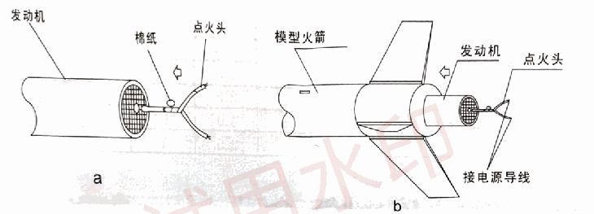

# 模型火箭发动机说明书

品牌：四凯模型  
标识：合格

> 本文按原 PDF 扫描件转录，保留原文内容及参数。安装示意图取自原件。

## 使用前必读

本产品与模型火箭产品配套使用。12岁以下青少年必须在成人指导下发射模型火箭。使用本产品前请仔细阅读并严格遵守《模型火箭安全使用准则》。

## 注意事项

1. 为确保安全，严禁解剖发动机或改变发动机结构，即不得以任何方式分解发动机或向发动机内填充异物，以免造成发动机结构的改变。严禁将其投入火中。
2. 发动机应在通风干燥处保存，同时避免阳光暴晒，并远离火源。发动机在开封后应尽快使用，若不使用应尽快密封后保存，避免受潮。
3. 依照模型火箭生产厂家的推荐，选择使用适当型号的发动机。
4. 发动机在运输及使用过程中应采取有效的减振措施，避免强烈碰撞、冲击、振动，以免造成发动机内部结构的损伤。
5. 不得使用超过有效期、有缺陷或有安全隐患的发动机，此类发动机应浸泡在水中销毁。

## 发动机工作原理

与一般的化学动力火箭发动机的工作原理基本相同，模型火箭发动机也是利用自身携带的推进剂在燃烧室燃烧，生成的高温高压燃气流经喷管时不断加速，最后以极高速度从喷管出口面喷射出去，从而产生反方向的推力。所不同的是，模型火箭发动机增加了用以实现箭体安全回收的延时剂和开伞剂。工作过程如下：

a. 接通电源点燃点火头，引燃推进剂，推进剂燃烧产生高温高压燃气，推动模型火箭不断上升；

b. 推进剂燃烧完毕后延时剂开始燃烧；

c. 延时剂燃烧完毕，开伞剂开始工作，产生大量气体，气体膨胀冲开堵盖，将回收装置连同头锥推出箭体筒段，从而实现箭体分离。降落伞打开，箭体安全回收。

## 发动机代号表示什么？

例：`A6-3`

| 代号部分 | 含义 | 说明 | 单位 |
| --- | --- | --- | --- |
| A | 总冲 | 表示发动机的总冲范围。 | 牛顿·秒 |
| 6 | 平均推力 | 表示发动机工作时产生的平均推力。 | 牛顿 |
| 3 | 延时时间 | 表示发动机工作结束到开伞剂开始工作之间的时间。 | 秒 |

## 发动机的安装

a. 将点火头插入发动机喷管底部，用牙签或其它硬质材料将棉纸塞在喷管与点火头的空隙处，使点火头可靠固定。（图a）

b. 按照箭体装配说明书中的要求，将组装好的发动机装入箭体尾部。（图b）

c. 释放自身静电，以防人体静电引发点火（具体释放人体静电的方法可以是操作者触摸接地铜棒，也可以触摸身边绿色植物或湿地）。

d. 拧开点火头的两条引线，确信安全销已被拔下的情况下将点火控制盒上的导线分别与点火头的两条引线连接。注意点火线上两个引线夹不能短路，且不能与发射架上的金属导流板接触。

## 火箭的发射

首先将安全销插入点火控制器中，电路正常时指示灯变亮。开始进入倒计时，“5-4-3-2-1-发射”，在听到“发射”口令时按下点火开关，模型火箭瞬间离开发射架升空。

## 故障及排除

发动机出现点火失败，通常可能是由于不恰当安装点火头而造成点火头破碎引起的，在确信安全销已被拔下的情况下，过一分钟后再靠近模型火箭，更换点火头并按安全操作要求重新安装。也可能是由于点火头触角导线发生短路引起的，同样在确信安全销已被拔下的情况下，过一分钟后再靠近模型火箭，检查点火头触角导线是否与导流板接触，采取有效绝缘措施之后重复上述发射过程。

## 有效期与保存条件

1. 有效期：一年（自出厂之日起）；
2. 生产日期：见发动机标签；
3. 保存条件：密封、室内保存；相对湿度：小于70%RH。

## 生产单位及联系方式

- **生产单位：** 陕西中天火箭技术股份有限公司
- **通信地址：** 西安市169信箱
- **邮箱：** 710025
- **电话：** （029）83601229、83311225
- **传真：** （029）83311225
- **网址：** http://www.zthj.com

## 附1：模型火箭发动机性能参数表

| 发动机型号 | 总冲（N·s） | 延时时间（s） | 最大载荷（g） | 平均推力（N） | 工作时间（s） | 初始质量（g） | 外形尺寸（mm） |
| --- | ---: | ---: | ---: | ---: | ---: | ---: | --- |
| A6-3 | 2.50 | 3 | 60 | 6 | 0.42 | 15.0 | Φ17.5 × 70 |
| B6-4 | 5.00 | 4 | 105 | 6 | 0.83 | 20.0 | Φ17.5 × 70 |
| C6-4 | 10.00 | 4 | 120 | 6 | 1.7 | 26 | Φ17.5 × 70 |
| C6-0 | 10.00 | 0 | 120 | 6 | 1.7 | 24 | Φ17.5 × 70 |
| 1/2 A3-2T | 1.25 | 2 | 30 | 3 | 0.42 | 6 | Φ12.5 × 55 |
| A3-2T | 2.50 | 2 | 40 | 3 | 0.83 | 8 | Φ12.5 × 55 |
| A3-4T | 2.50 | 4 | 40 | 3 | 0.83 | 9 | Φ12.5 × 55 |
| B2-3T | 5.00 | 3 | 45 | 2 | 2.5 | 12 | Φ12.5 × 68 |
| B2-5T | 5.00 | 5 | 45 | 2 | 2.5 | 13 | Φ12.5 × 72 |
| D5-0 | 20.00 | 0 | 240 | 5 | 4.0 | 40 | Φ20 × 90 |
| MINIA1-3 | 2.50 | 3 | 50 | 1 | 2.5 | 7 | Φ10.5 × 58 |

## 附2：《模型火箭安全使用准则》

### 1. 材料

模型火箭必须使用纸张、木材、塑料等轻质非金属材料制作。禁止使用金属材料制作模型火箭的头锥、尾翼或箭体筒段。

### 2. 模型火箭发动机

模型火箭必须使用国家认定的专业厂家生产及推荐使用的模型火箭发动机。不得以任何方式对发动机的结构、装药成份或剂量进行改动。模型火箭必须存放在阴凉干燥处，并远离火源。禁止在任何地方以任何方式单独点燃模型火箭发动机。

### 3. 回收装置

模型火箭必须带有减缓其下降速度的回收装置，以保证模型能安全回收和重复使用。

### 4. 重量及能量限制

模型火箭的最大起飞质量不得大于500克，模型火箭起飞时所携带发动机或发动机产生的总冲不得大于100牛顿·秒（N·s）。模型火箭起飞质量必须小于厂家推荐的该型号发动机最大起飞质量。

### 5. 稳定性

模型火箭首次飞行前，必须对其飞行稳定性作出正确的评估或检查。除非模型火箭的稳定性已经得到验证。

### 6. 载荷

除小昆虫外，模型火箭不得携带其它任何活的动物，模型火箭禁止携带任何有燃烧、爆炸或具有伤害性的载荷。

### 7. 发射区域

模型火箭必须在户外空旷的地方（无高大树木、电线或动物或干草地）发射，发射最小区域列表如下：

| 发动机总冲（N·s） | 发动机型号 | 发射最小区域尺寸（m） |
| --- | --- | ---: |
| 0.00～2.50 | A | 30 |
| 2.51～5.00 | B | 60 |
| 5.01～10.00 | C | 120 |
| 10.01～20.00 | D | 150 |
| 20.01～40.00 | E | 300 |

### 8. 发射装置

模型火箭必须在一个稳定的发射装置上进行发射，这种发射装置必须带有一个刚性导轨，使模型火箭离开发射架时达到一定的速度，以保证模型火箭能以安全的轨迹飞行。为了保护眼睛不被意外伤害，当靠近发射架时，导向杆的顶端必须位于眼睛以上或盖住导向杆顶端。发射架不使用时，必须将其拆卸存放。发射架必须带有导流板（火焰反射器）防止发动机燃气直接喷射到地面。发射时，必须将发射架周围的干草、杂物或其它易燃物质清理干净。

### 9. 点火系统

模型火箭点火装置必须采用远距离控制、电操纵方式。它带有一个处于“常开”状态的发射按钮，同时还必须带有一个与点火按钮串联的可移开的安全插销。发射模型火箭时，如果发动机总冲小于30N·s时，所有人员距发射点不小于5米，如果发动机总冲大于30N·s时，所有人员距发射点不小于10米。必须使用生产厂推荐使用的电点火控制器。

### 10. 发射安全性

模型火箭发射前，必须发出5秒倒计时口令，以保证在场人员都能意识到并看见模型火箭发射。不能把模型火箭作为一种武器以任何地面或空中物体为目标进行发射。如果发生点火失败，在完全切断点火电源以前，任何人不得靠近发射架，切断电源一分钟后，才能靠近发射架。

### 11. 飞行条件

当风速大于30Km/h，不要发射模型火箭。在大风、雨天、邻近有建筑物、输电线和高大树木地区，低空有飞行器飞越的空域，禁止飞行模型火箭。模型火箭不应对任何人或物造成伤害。

### 12. 预先发射试验

在对未被验证的模型火箭设计或方法进行研究时，必须尽可能通过预先发射试验的方式确定模型火箭的稳定性。在发射未被验证的模型火箭时，与实验无关人员不得观看或参加发射试验。

### 13. 发射角度

发射装置与垂直方向的夹角不得大于30°。禁止用模型火箭发动机水平推动任何装置。

### 14. 回收危险性

如果模型火箭落在电线或其它危险的地点，必须放弃回收模型，以免造成意外人身伤害。
